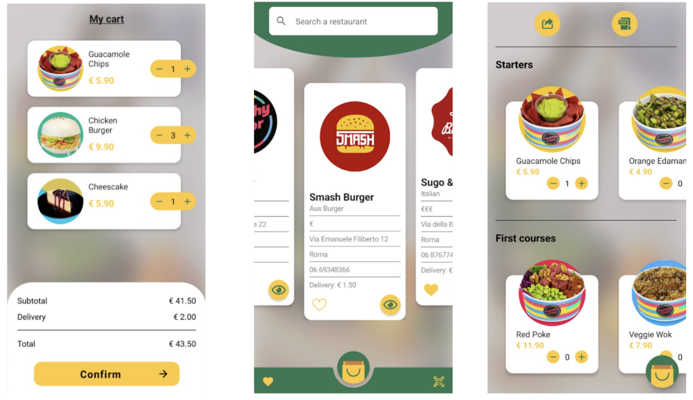
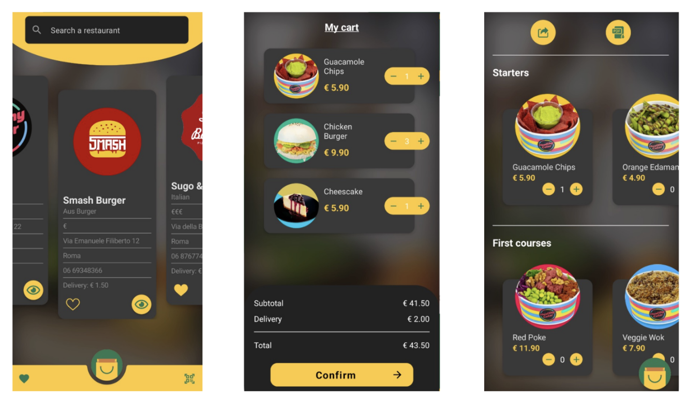
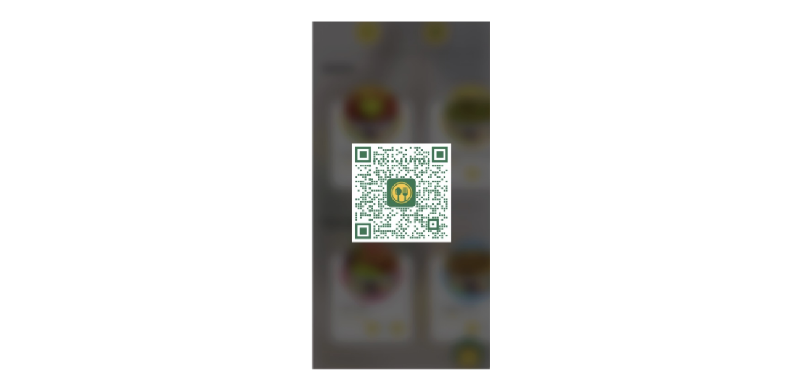

# MenuApp

An Android application for browsing restaurant menus, selecting dishes, and sharing menus as QR
codes. Built with Jetpack Compose and Kotlin coroutines against a static JSON data set.

<p align="center">
  
</p>

## Overview

The app fetches a list of restaurants, then a menu for the selected restaurant, and renders it in
seven categories. Dishes are added to an order with a quantity stepper. The order is held in one
cart shared by the menu and cart screens, so changing a quantity on either is immediately visible
on the other. A menu can be shared as a QR code, and scanning one opens that restaurant's menu.

Data comes from a read-only set of JSON files served over HTTPS. There is no backend and no
account system; the cart lives in memory for the duration of the session.

## Features

- Restaurant list with text search and a favourites filter
- Menu grouped into starters, first courses, second courses, sides, fruits, desserts and drinks
- Dish selection and deselection with a shared cart; the cart holds one restaurant at a time and
  asks before switching
- Order summary with subtotal, per-restaurant delivery fee and total
- Favourites stored locally with Room
- QR code generation for a menu, and camera scanning to open a scanned menu in the app
- Light and dark themes; English and Italian strings; portrait and landscape layouts

## Architecture

Unidirectional data flow with one `ViewModel` for the Activity. State flows down as immutable
values, events flow up as callbacks, and composables perform no I/O.

```
MainActivity → MenuApp (routing, BackHandler)
                 │
                 ├── HomeScreen · MenuScreen · CartScreen · QrCodeScannerScreen
                 │     stateless; take UiState + callbacks
                 │
                 └── MenuViewModel
                       StateFlow: previews · menu · cart · favourites · current screen
                       │
                       ├── MenuRepository → RestaurantApi (Volley) → MenuJsonParser (Gson)
                       └── FavouritesRepository → Room DAO
```

Notable pieces:

- **`MenuViewModel`** holds everything that outlives a composition: the loaded previews and menu,
  the cart, the search query, the favourites filter, and a navigation back stack. State therefore
  survives configuration changes without refetching.
- **`Screen`** is a sealed interface (`Home`, `MenuDetail(id)`, `Cart`, `Scanner`). Navigation is a
  list of these in the ViewModel plus a `BackHandler`; no navigation library is used.
- **`Cart`** (in `domain/`) is immutable — every mutation returns a new cart. It owns the quantity
  arithmetic, the totals, and the one-restaurant-at-a-time rule, which it reports as a return type
  rather than a UI flag. `Course` carries no quantity, so the two screens cannot disagree.
- **`MenuQrPayload`** (in `domain/`) owns the QR URL format for both encoding and decoding, and
  never throws on malformed scanned input.
- **`MenuJsonParser`** parses with Gson's tree API. It accepts both the camelCase and lowercase
  spellings of the menu section keys, skips entries it cannot read rather than failing a whole
  response, and rejects structurally invalid documents.
- **`RestaurantApi`** wraps Volley in cancellable `suspend` functions over a single
  process-wide `RequestQueue`, and classifies failures into typed error kinds.
- **`UiState`** is `Loading | Success | Error`, so loading and failure are rendered explicitly.

`domain/` and `model/` contain no Android imports, which is what allows the selection rules and QR
format to be covered by plain JVM tests. Dependencies are constructed in `MenuApplication`; the
object graph is small enough that a DI framework would not earn its build cost.

## Project structure

```
app/src/main/java/com/alessandrocaruso/menuapp/
    MainActivity.kt          Activity host and screen routing
    MenuApplication.kt       Object graph (Volley queue, repositories, QR payload)
    data/                    RestaurantApi, MenuRepository, MenuJsonParser
    data/favourites/         Room database, DAO, favourites repository
    domain/                  Cart, MenuQrPayload — pure Kotlin
    model/                   Course, Menu, RestaurantPreview
    ui/                      UiState, Screen, price formatting
    ui/components/           CourseCard, RestaurantCard, QuantityCounter, RemoteImage, state views
    ui/layout/               Home, Menu, Cart and scanner screens
    ui/theme/                Colours, shapes, typography
    utils/                   QRCodeAnalyzer, QrCodeGenerator, MenuDownloader
    viewmodel/               MenuViewModel

app/src/test/                JVM unit tests
app/src/test/resources/fixtures/   Recorded API responses used by those tests
app/src/androidTest/         Instrumentation tests
gradle/libs.versions.toml    Dependency versions
scripts/refresh-fixtures.sh  Re-records the test fixtures from the live data set
.github/workflows/ci.yml     Build, test and lint
```

## Installation

Requires **JDK 17** and the Android SDK (compileSdk 34, build-tools 34.0.0). Android Studio
Jellyfish or newer includes both.

```bash
git clone https://github.com/al3ssandrocaruso/MenuApp
cd MenuApp

# Android Studio writes this file for you; set it manually for a command-line build.
echo "sdk.dir=$HOME/Library/Android/sdk" > local.properties   # macOS
# echo "sdk.dir=$HOME/Android/Sdk" > local.properties          # Linux

./gradlew assembleDebug
```

The APK is written to `app/build/outputs/apk/debug/app-debug.apk`.

## Usage

```bash
./gradlew installDebug
adb shell am start -n com.alessandrocaruso.menuapp/.MainActivity
```

`minSdk` is 28 (Android 9). The scanner requires a camera and the `CAMERA` permission, requested at
runtime; the rest of the app works without one.

### Data source

Endpoints are `BuildConfig` fields declared in `app/build.gradle`, so the app can be pointed at a
different data set without code changes:

| Field | Default | Used for |
| --- | --- | --- |
| `DATA_BASE_URL` | `https://raw.githubusercontent.com/al3ssandrocaruso/restaurantsappdata/main/` | `restaurants/allpreviews`, `menus/{id}` |
| `MENU_PDF_BASE_URL` | `https://github.com/al3ssandrocaruso/restaurantsappdata/raw/main/menus/PDFsMenu/` | QR payloads and PDF downloads |

Expected shapes:

```jsonc
// GET {DATA_BASE_URL}restaurants/allpreviews
{ "Restaurants": [
    { "id": "1", "name": "Smash Burger", "type": "Aus Burger", "poster": "https://…",
      "price": "€", "address": "…", "city": "Roma", "phone": "…", "delivery": "1.50" }
]}

// GET {DATA_BASE_URL}menus/1
{ "id": "1", "ristorante": "Smash Burger",
  "starters":     [ { "name": "Nachos", "price": "4.50", "poster": "https://…",
                      "description": "Tortillas di mais" } ],
  "firstCourses": [ … ], "secondCourses": [ … ], "sides": [ … ],
  "fruits":       [ … ], "desserts":      [ … ], "drinks": [ … ] }
```

Only `id` and `name` for a restaurant, and `name` and `price` for a dish, are required. Missing
fields are defaulted and unreadable entries are skipped.

## Testing

```bash
./gradlew testDebugUnitTest          # 74 JVM tests
./gradlew connectedDebugAndroidTest  # instrumentation tests; requires a device or emulator
./gradlew lintDebug                  # Android Lint
```

**JVM tests (74, all passing).** They cover JSON parsing, the cart and selection rules, QR payload
encoding and decoding, QR generation, and `MenuViewModel` state transitions. Responses recorded
from the live data set live in `app/src/test/resources/fixtures`, so the suite is deterministic and
needs no network. Re-record them with `./scripts/refresh-fixtures.sh` when the data changes.

The QR coverage is a round trip: a payload is encoded to a module matrix, decoded with the same
ZXing configuration the camera analyser uses, and interpreted by `MenuQrPayload`. Malformed input —
path traversal, query strings, foreign QR codes — is covered too.

**Instrumentation tests (6).** They cover the composed cart screen and the real Room schema. These
compile and are wired into CI, but were **not executed** during development: no device or emulator
was available. See Limitations.

## Build and CI

Gradle 8.7, AGP 8.4.2, Kotlin 1.9.24, compileSdk/targetSdk 34, minSdk 28. Dependency versions are
pinned in `gradle/libs.versions.toml` and resolve from Google's Maven repository and Maven Central
only.

`.github/workflows/ci.yml` runs on push and pull request: unit tests, `assembleDebug`, Android
Lint, and compilation of the instrumentation sources. The debug APK and the test and lint reports
are uploaded as artifacts. Emulator-backed instrumentation tests are a separate job, gated to
`main` and manual dispatch. No step depends on an external service beyond the two Maven
repositories.

`./gradlew assembleRelease` produces an unsigned APK with R8 and resource shrinking enabled. No
signing config is committed; add one with credentials from an untracked `keystore.properties` or
environment variables.


## Screenshots

### Dark mode

<p align="center">
  
</p>

### Light mode

<p align="center">
  
</p>

### QR code menu

<p align="center">
  
</p>

## Dependencies

Compose (Material) · Kotlin coroutines and `StateFlow` · AndroidX ViewModel and Lifecycle · Room
(with KSP) · Volley · Gson · Coil · CameraX · ZXing, used for both QR generation and decoding.
